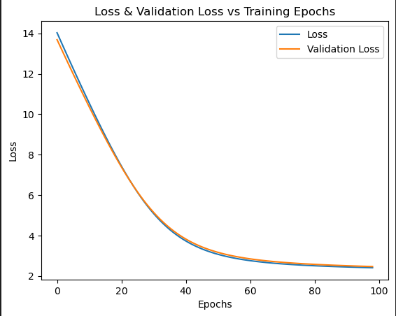

# Drug Classification Python

This is a custom code to classify which kind of drug to give to a patient based on 5 features. As of now, there is an issue in gradient implementation and I am not able to find it. But will be done soon.

## Data Visualization

## Training & Testing Results

